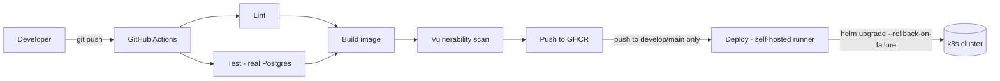
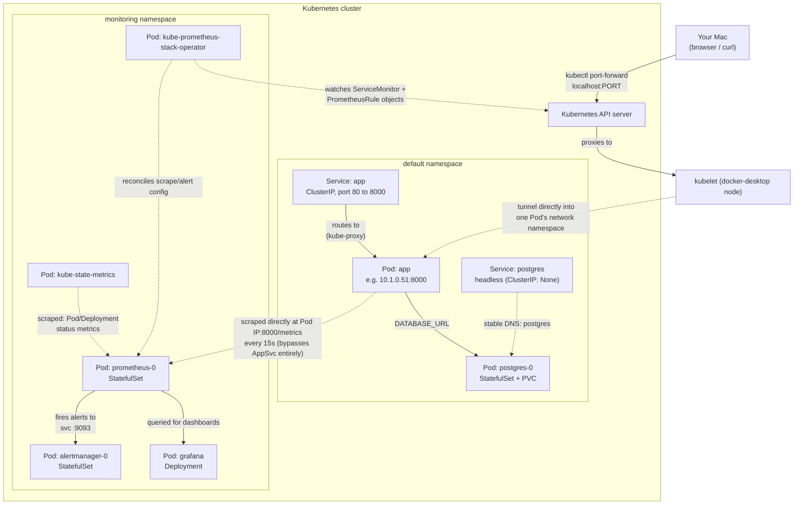
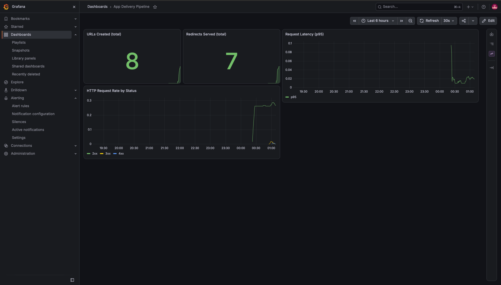
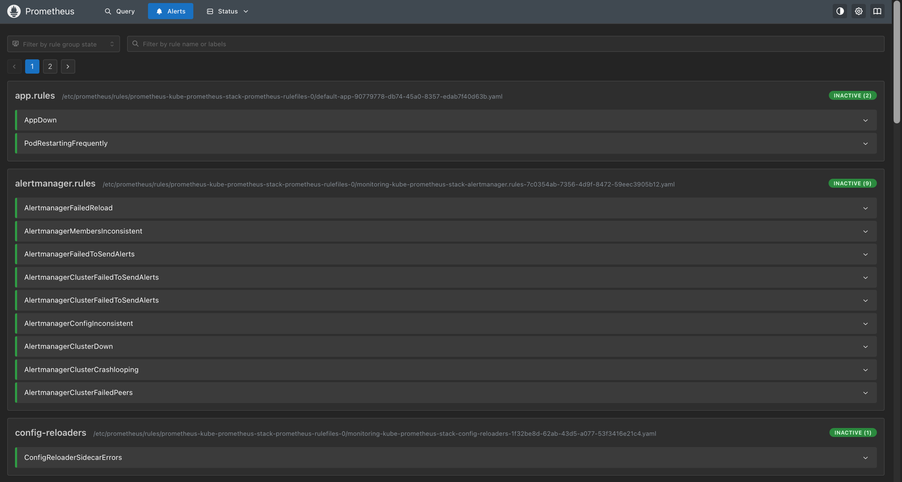

# App Delivery Pipeline

A small FastAPI URL shortener (Postgres-backed), built as an end-to-end
demonstration of a real delivery pipeline: containerized, deployed to
Kubernetes via Helm, shipped through a CI/CD pipeline with a self-hosted
runner, and observed with Prometheus/Grafana/Alertmanager.

## Project Structure

```
.
├── src/                          # FastAPI app
│   ├── api/urls.py               # POST/GET /urls, /{short_code}, /stats
│   ├── db/                       # SQLAlchemy models + session
│   ├── schemas/                  # Pydantic request/response models
│   └── main.py                   # app setup, /healthz, /readyz, /metrics
├── tests/                        # pytest, real Postgres, no mocking
├── helm/
│   ├── app-delivery-pipeline/    # this app's chart (Deployment, Service,
│   │                             #   Postgres StatefulSet, ServiceMonitor,
│   │                             #   PrometheusRule, Grafana dashboard)
│   └── monitoring/                # values override for kube-prometheus-stack
├── .github/workflows/ci.yml      # lint -> test -> build -> scan -> push -> deploy
├── Dockerfile / docker-compose.yml
└── docs/screenshots/
```

## Architecture

**CI/CD pipeline** (`.github/workflows/ci.yml`) — `lint`/`test`/`build`/`scan`
run on every push and PR; `push`/`deploy` only run on a real push to
`develop`/`main` (never on `pull_request`), so unreviewed code can never
publish an image or touch the cluster:



**Runtime, in-cluster** — reflects the actual mechanics confirmed while
building this (real Pod IPs, `kubectl port-forward`'s real path, Prometheus
scraping the app's Pod IP directly rather than through the Service):



## Setup

```bash
python -m venv .venv
source .venv/bin/activate
pip install -r requirements.txt
cp .env.example .env  # then set DATABASE_URL
```

## Database

This project expects a local PostgreSQL server (installed via Homebrew, e.g. `brew install postgresql@16`).

```bash
# Start Postgres (runs in the background, survives reboots)
brew services start postgresql@16

# Check it's running
brew services list | grep postgresql   # should show "started"
pg_isready                             # should print "accepting connections"

# Stop it
brew services stop postgresql@16
```

Create the database once (name must match `DATABASE_URL` in `.env`):

```bash
createdb app_delivery_pipeline
```

## Run

Three equivalent ways to start the server, all from the project root:

```bash
# 1. Plain python — runs src/main.py's __main__ block, which calls uvicorn.run() internally
python -m src.main

# 2. FastAPI CLI — wraps uvicorn, adds auto-reload and a dev landing page
fastapi dev src/main.py

# 3. Uvicorn CLI directly — most explicit, used in production
uvicorn src.main:app --reload
```

All three end up running the same `app` object on `http://localhost:8000`. Use `python -m src.main`
for quick manual checks, `fastapi dev` for day-to-day local development, and the bare `uvicorn`
command (without `--reload`) for production.

## Endpoints

- `GET /healthz` - liveness check
- `GET /readyz` - readiness check (verifies DB connection)
- `GET /urls` - list all shortened URLs
- `POST /urls` - create a shortened URL from `{"original_url": "..."}`, returns the new `short_code`
- `GET /{short_code}` - redirect to the original URL and record a click
- `GET /urls/{short_code}/stats` - total click count and recent click timestamps
- `GET /metrics` - Prometheus metrics (request counts/latency, plus `urls_created_total`/`redirects_total`)

## Testing

```bash
pip install -r requirements-dev.txt
createdb app_delivery_pipeline_test   # first time only
pytest -v
ruff check .                          # lint, same check CI runs
```

Tests run against a real Postgres database (`app_delivery_pipeline_test`),
isolated from your dev data — no mocking. `pytest` uses `TestClient` to call
the app directly in-process, so no server needs to be running first.

## Docker

```bash
docker build -t app-delivery-pipeline:latest .
docker compose up --build   # app + Postgres together, healthcheck-gated startup
```

Non-root user, `.dockerignore` keeps the build context lean. See `COMMANDS.md`
for the full local/Docker/Kubernetes/Helm/CI-CD command reference.

## Kubernetes & Helm

Deployed via the chart in `helm/app-delivery-pipeline/` — Deployment + Service
for the app, a StatefulSet + PVC for Postgres (stable identity/storage for a
database, unlike a plain Deployment), and an init container that waits for
Postgres before the app starts (closes a real race condition — see
`ISSUES.md`).

```bash
helm upgrade app helm/app-delivery-pipeline \
  --install \
  --set app.image.tag=<sha-or-tag> \
  --wait --timeout 2m --rollback-on-failure
```

`values.yaml` points at `ghcr.io/khangpham05/app-delivery-pipeline` by
default — this is also exactly what the automated `deploy` CI job runs.

## CI/CD

GitHub Actions (`.github/workflows/ci.yml`): `lint` → `test` → `build` →
`scan` → `push` (GHCR) → `deploy`. The `deploy` job runs on a **self-hosted
runner** (your own machine, registered under Settings → Actions → Runners) —
GitHub-hosted runners have no network path to a local cluster, so this is
the one job that needs to run somewhere that does. It's gated to only ever
run on a real `push` to `develop`/`main`, never on a `pull_request`, so
unreviewed code can never execute on that machine or touch the cluster.

## Monitoring

`kube-prometheus-stack` (Prometheus + Grafana + Alertmanager), installed via
`helm/monitoring/values.yaml` into its own `monitoring` namespace, separate
from app workloads. `node-exporter` and the default Kubernetes control-plane
scrape targets are disabled/expected-down — Docker Desktop on macOS doesn't
expose host/control-plane metrics the way a real cluster would; irrelevant
to monitoring this app either way.

- **`ServiceMonitor`** (`helm/app-delivery-pipeline/templates/servicemonitor.yaml`) —
  tells Prometheus to scrape the app's `/metrics` every 15s. Guarded by a
  `.Capabilities` check so the chart never breaks if monitoring isn't installed.
- **Grafana dashboard** (`.../grafana-dashboard.yaml`) — provisioned as code via
  a labeled `ConfigMap`, auto-discovered by Grafana's sidecar. No manual import.
- **Alerts** (`.../prometheusrule.yaml`) — `AppDown` and `PodRestartingFrequently`,
  viewable in Alertmanager's own UI only (no Slack/email wired up — this is a
  solo local project, not something anyone's on-call for).

<p float="left">
  
  
</p>

```bash
helm upgrade --install kube-prometheus-stack prometheus-community/kube-prometheus-stack \
  --namespace monitoring --create-namespace \
  --version 88.6.3 \
  -f helm/monitoring/values.yaml \
  --wait --timeout 3m
```

## TODO
- [ ] Add branch protection requiring CI to pass before merge (optional hardening)
